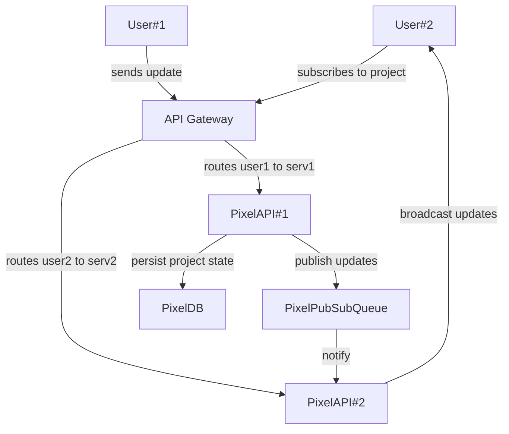
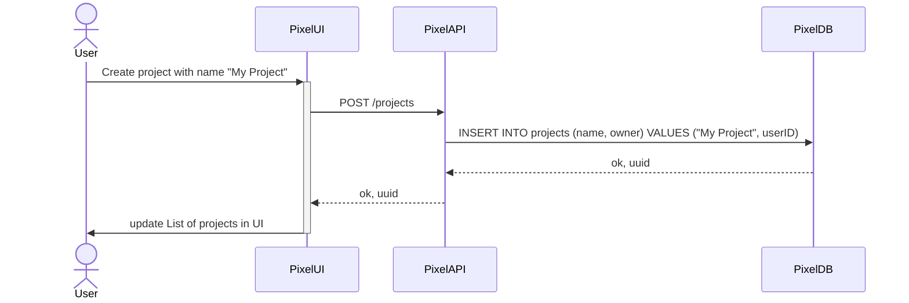
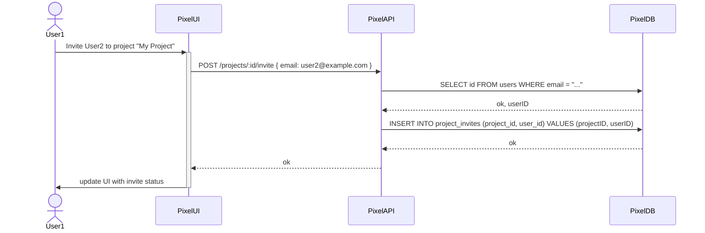
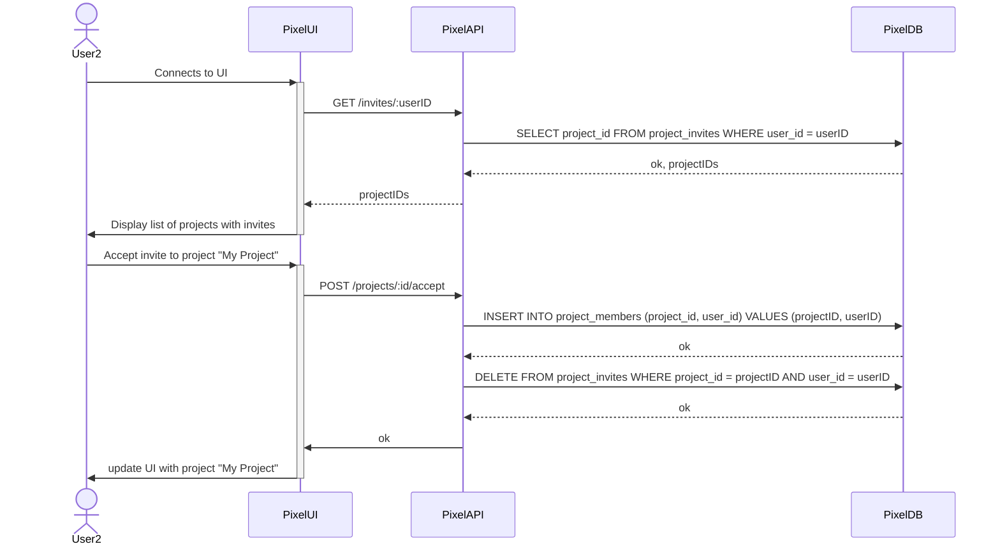
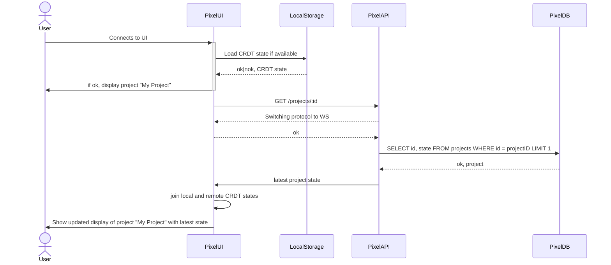
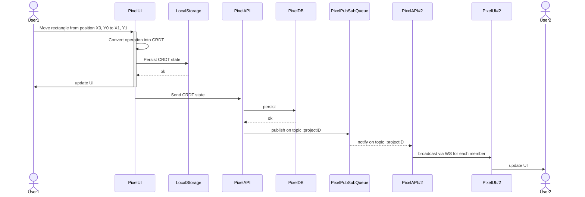

# Live Collab r/place

## Context

We are investing in pixel art pages as our next vertical opportunity, more specifically collaborative pixel art pages.

## Functional requirements

We have identified the following functional requirements:

- add rectangles of any color to the scene
- resize and move each rectangle
- delete rectangles
- change the order of the rectangles (rectangles can overlap each other)

Simplifications:

- No text editing, only rectangles

## Non-functional requirements

We have identified the following non-functional requirements:

- 100 concurrent users on a single project
- 10k _open_ projects
- Zero downtime deployments
- Resilient to network failures that are below 2s

Back of the envelope calculations:

- 0.5 edit per second per user
- 50 edits per second per project
- 500k edits per second for all projects
- assuming 10-40ms per edit due to network latency, concurrent edit (in flight edits) is a certainty.

Simplifications:

- Access by browser only
- Authentication and authorization are not required (already handled by the platform)

## Goals

- Define the data model for each pixel art project and its associated lifecycle
- Define a scalable architecture for the pixel art API
- Define the project key operating metrics and their associated monitoring

## Non-Goals

- Propose a complete implementation of the pixel art API

## Prior State of the Art

### Collaborative Editing

#### CRDTs

CRDTs are a family of algorithms that allow for the replication of data across multiple nodes in a network. They are designed to be highly available and fault-tolerant, and they can be used to build distributed systems that are resilient to network partitions. CRDTs are used in a variety of applications, including collaborative editing, distributed databases, and real-time analytics.

CRDTs are designed to be eventually consistent, which means that they can tolerate network partitions and other failures without sacrificing data integrity. They achieve this by using a set of rules that ensure that all replicas of the data converge to the same state, even if they are updated independently.

CRDTs come in several different flavors, including state-based CRDTs and operation-based CRDTs. State-based CRDTs replicate the entire state of the data to all nodes in the network, while operation-based CRDTs replicate only the operations that have been performed on the data. Both types of CRDTs have their own advantages and disadvantages, and the choice between them depends on the specific requirements of the application.

Common CRDTs include:

- G-Counter: A grow-only counter that can be incremented by any node in the network.
- PN-Counter: A counter that can be incremented and decremented by any node in the network.
- G-Set: A grow-only set that can add elements to the set.
- 2P-Set: A set that can add and remove elements from the set.
- LWW-Element-Set: A set that uses timestamps to resolve conflicts between concurrent updates.
- ADW: A crdt representation of a set where adding and removing elements are treated as separate operations, such that adding an element wins over removing it.
- RGA: A tree based representation of a list that allows for concurrent insertions and deletions by assigning unique identifiers to each element and using those to sort the tree using Depth-First Search.
- etc.

CRDTs are composable and can be combined to build more complex data structures. More advanced CRDTs, such as maps, graphs, and trees, are built on top of the basic CRDTs to support a wider range of applications.

##### Zoom-in on G-Counter

A G-Counter is a grow-only counter that can be incremented by any node in the network. It is a simple and efficient CRDT that is used in a variety of applications, including distributed databases, real-time analytics, and distributed file systems.

Each node has its own counter represented by its node pid, and the value of the counter is the sum of the values of all the counters in the network. When a node increments its counter, it sends a message to all other nodes in the network to inform them of the update. Each node then updates its own counter with the new value.

```go
type GCounter struct {
   pidCounts map[string]int
}
func (g *GCounter) Increment(pid string) {
   g.pidCounts[pid] += 1
}
func (g GCounter) Value() (sum int) {
   for _, c := range g.pidCounts {
       sum += c
   }
   return
}
func (g *GCounter) Join (other GCounter) {
   for pid, c := range other.pidCounts {
       g.pidCounts[pid] = MaxInt(g.pidCounts[pid], c)
   }
}
```

##### Zoom-in on G-Set

A G-Set is a grow-only set that allows elements to be added to the set but not removed. It is a simple and efficient CRDT that is used in a variety of applications, including distributed databases, real-time collaboration tools, and distributed file systems.

```go
type GSet[K comparable, T any] struct {
   elements map[K]T
}
func (g *GSet[K, T]) Add(elt K, val T) {
   g.elements[elt] = val
}
func (g GSet[K, T]) Value(elt K) (T, bool) {
   val, ok := g.elements[elt]
   return val, ok
}
func (g *GSet[K, T]) Join(other GSet[K, T]) {
   for elt, val := range other.elements {
       g.Add(elt, val)
   }
}
```

##### Zoom-in on LWW

LWW is a CRDT that uses timestamps to resolve conflicts between concurrent updates. It consists of two sets: a set of elements that have been added to the data structure and a set of elements that have been removed from the data structure. Each element in the data structure is associated with a timestamp that indicates when it was added or removed.

When two nodes update the data structure concurrently, LWW uses the timestamps to determine which update should take precedence. If two updates have the same timestamp, LWW uses a tie-breaking rule to resolve the conflict. For example, it may choose the update that was performed by the node with the lowest identifier.

The timestamp used by LWW can be a logical timestamp, which is generated by the node itself, or a physical timestamp, which is generated by a clock that is synchronized across all nodes in the network. Logical timestamps are usually preferred, as they are more resilient to clock skew and other issues.

```go
type LWWSet[K comparable] struct {
   timestamp GCounter
   plus GSet[K, GCounter]
   minus GSet[K, GCounter]
}
func (lww *LWWSet[K]) Add(elt K, pid string) {
   lww.timestamp.Increment(pid)
   lww.plus.Add(elt, lww.timestamp.Value())
}
func (lww *LWWSet[K]) Remove(elt K, pid string) {
   lww.timestamp.Increment(pid)
   lww.minus.Add(elt, lww.timestamp.Value())
}
func (lww LWWSet[K]) Value(elt K) (int, bool) {
   removedAt, removed := lww.minus.Value(elt)
   addedAt, added := lww.plus.Value(elt)
   if addedAt > removedAt {
       return addedAt, true
   }
   return removedAt, false
}
func (lww *LWWSet[K]) Join(other LWWSet[K]) {
   lww.timestamp.Join(other.timestamp)
   lww.plus.Join(other.plus)
   lww.minus.Join(other.minus)
}
```

##### Zoom-in on ADW

A set datatype in which additions take precedence over removals. For example, if one replica removes and re-adds an element, while another replica concurrently removes the element, then the merged outcome is that the element is in the set. Contrast with OR sets aka remove-wins set (where removals take precedence over additions).

ADW-Set and OR-Set are very similar to the LWW set CRDT, but they use unique tags instead of timestamps.

##### State-based CRDTs

State-based CRDTs replicate the entire state of the data to all nodes in the network. This makes them highly available and fault-tolerant, as each node can operate independently of the others.

##### Operation-based CRDTs

Operation-based CRDTs replicate only the operations that have been performed on the data. This makes them more efficient than state-based CRDTs, as they do not need to replicate the entire state of the data to all nodes in the network. Operation-based CRDTs assume perfect delivery of messages between nodes, which usually implies building an abstraction on top of a reliable transport layer to guarantee message delivery.

#### Operational Transformation

Operational Transformation (OT) is a technique for building collaborative editing systems that allow multiple users to edit a shared document at the same time. OT is used in a variety of applications, including text editors, spreadsheets, and drawing tools.

OT works by transforming the operations that are performed by each user so that they can be applied in a consistent order on all replicas of the document. This ensures that all users see the same changes to the document, even if they are editing it simultaneously.

OT is designed to be highly available and fault-tolerant, and it can handle a wide range of network failures and other issues. It is used in a variety of real-time collaboration tools, including Google Docs, Etherpad, and SubEthaEdit.

OT rely on a central server to coordinate the operations of all users, which can introduce latency and scalability issues, though the implementation of OT is generally regarded as simpler than CRDTs.

### Real-time Collaboration

#### WebSockets

WebSockets are a protocol that allows for bidirectional communication between a client and a server over a single TCP connection. They are used in a variety of applications, including real-time chat, online gaming, and collaborative editing. WebSockets imply a central server that coordinates the communication between clients.

#### WebRTC

WebRTC is a set of APIs that allow for real-time communication between browsers. It is used in a variety of applications, including video conferencing, file sharing, and screen sharing. Its focus is on peer-to-peer communication, which can reduce latency and improve scalability. It is sometimes possible to do direct connections between peers using WebRTC, but it is generally more complex to implement than WebSockets and requires the ability to punch holes in firewalls.

#### Active Polling

Active polling is a technique that involves the client periodically sending requests to the server to check for updates. It is used in a variety of applications, including chat, notifications, and real-time collaboration. Active polling is usually effective in situations with low update rates and short-lived sessions. It increases latency and potentially server load, as the server may need to process a large number of requests. It also requires the server to maintain state for each client, which can introduce complexity and scalability issues.

### Internal knowledge

| Technology                 | Knowledge |
| -------------------------- | --------- |
| CRDTs                      | High      |
| Active Polling             | High      |
| WebSockets                 | Medium    |
| Kubernetes                 | Medium    |
| Terraform                  | Medium    |
| Datadog                    | Medium    |
| JavaScript                 | Medium    |
| Operational Transformation | Low       |
| WebRTC                     | Low       |
| Elixir                     | Low       |
| Phoenix                    | Low       |
| Automerge                  | Low       |

## Proposal

We use CRDTs to maintain the state of the pixel art project and WebSockets to broadcast updates to all members of the project. We use a set of central servers to coordinate the communication between clients and to persist the state of the project.

Persistence is done through a database that stores the state of the project and the order of the rectangles. The database is used to recover the state of the project in case of a server failure. The state of the project is stored in a CRDT format, which removes the need for consensus.

### Data Model

There are two main entities in the pixel art project: the project itself and the rectangles that are part of the project.

```typescript
type UserID = string; // unique identifier --- UUIDv4

interface Color {
  r: number; // red component (0-255)
  g: number; // green component (0-255)
  b: number; // blue component (0-255)
  a: number; // alpha component (0-1)
}

interface Rectangle {
  id: string; // unique identifier --- UUIDv4
  x: LWW<number>; // x-coordinate of the top-left corner
  y: LWW<number>; // y-coordinate of the top-left corner
  width: LWW<number>;
  height: LWW<number>;
  color: LWW<Color>;
}

type Component = Rectangle; // rectangle or other components once implemented

type ListCRDT<T> = YATA<T> | RGA<T> | CausalTree<T>; // some sort of list CRDT
type Position = int; // position in the list

interface Project {
  id: string; // unique identifier --- UUIDv4
  name: string; // project name
  members: GSet<UserID>; // members of the project
  components: ListCRDT<Component>; // rectangles that are part of the project
  order: AWMap<Component["id"], LWW<Position>>; // order of the rectangles - this (complex) design allows for swap operations.
}
```

### Architecture

#### Technical choices

We propose to use the following technologies to implement the pixel art project:

- Kubernetes + Terraform for the infrastructure
- Elixir with Phoenix for the API
- Automerge for the project state management
- Any modern frontend framework for the UI (React, Vue, Svelte, etc.)

We create a small API client that connects to the API and manages the state of the project using Automerge. The client uses WebSockets to receive updates from the server and to broadcast its own updates to the server.

##### Language choice

We chose Elixir with Phoenix for the API because:

- Elixir is a functional programming language that is well-suited for building distributed systems.
- Phoenix comes with batteries included when it comes to PubSub and WebSockets via the concept of Channels.

It is possible to build the same system using other languages and frameworks, at the cost of introducing additional moving parts, like a queuing system for broadcasting updates.

##### CRDT choice

We chose Automerge for the project state management because:

- Automerge is a CRDT library that is designed for real-time collaboration.
- Automerge provides good integrations with websockets.

### Distributed Broadcast

Because of the scale of the system (est. 500k RPS), the design cannot fit on a single server. We use a set of servers to distribute the load and to provide fault tolerance and high availability. This introduces complexity around broadcasting updates to all members of the project, as the servers need to coordinate with each other to ensure that all members receive the updates.

We use a pubsub queue to broadcast updates to all members of the project. Each server subscribes to the queue and receives the updates in real-time. This allows for efficient and scalable broadcasting of updates to all members of the project.

The projectID is used as a topic.



### Sequence diagrams

We document below the sequence diagrams for the main operations of the pixel art project.

#### User creates a project



#### User invites other user to project



#### User accepts invite to project



#### User fetches a project

We use an optimistic approach if the user has already connected to the project. The UI is updated with the latest state of the project once the server replies with its own version of the data.



#### User updates UI

We use an optimistic UI approach where the user can move a rectangle without waiting for the server to confirm the operation. The operation is converted into a CRDT and persisted in the local storage. The server is then updated with the CRDT state.

This allows for offline editing and reduces latency for the user, which makes network issues less of an issue.



### Zero-downtime deployments

The servers are fundamentally stateless, which allows for zero-downtime deployments. We use a rolling deployment strategy to update the servers one by one without interrupting the service. This ensures that there is no downtime during the deployment process.

To ensure a seamless experience, when a server goes down for deployment, the connections are closed and the clients automatically try to reconnect via the load balancer. The load balancer routes the clients to the remaining servers, which ensures that the service remains available during the deployment process.

During the reconnection process, the clients will request the latest state of the project from the server, which ensures that they have the most up-to-date data once the deployment is complete.

### Monitoring

Key metrics:

- Number of concurrent users
- Number of open projects
- Number of in-flight edits (as seen in the PubSub queue)
- Latency of the system (measured as time between update and broadcast inside the servers)

We use Datadog to monitor the key metrics of the system. Datadog provides real-time monitoring and alerting for the servers, which allows us to quickly identify and resolve any issues that may arise.

### Scaling risks

The main scaling risks of the system is if the number of concurrent edits is higher than our ability to broadcast them to all members of the project: This leads to a backlog of updates in the PubSub queue, which can cause latency issues for the users.

Mitigation is complex as it involves scaling up the number of servers and rebalancing the load between servers (since websocket connections are sticky to one server). This can be done by broadcasting a message to all clients to reconnect to the load balancer, which will then route them to the new servers.

### Disaster recovery

In case of network partition:

- The servers will continue to operate independently and broadcast updates to all members of the project. On resolution of the network partition, the servers will reconcile their states and ensure that all members receive the updates.

In case of server failure:

- The load balancer will route the clients to the remaining servers, which ensures that the service remains available during the server failure. The clients will request the latest state of the project from the server, which ensures that they have the most up-to-date data once the server is restored.

In case of project data loss:

- The project data is held on each device and can be re-synchronized with the server. If the server has lost the data, the clients can re-send the data to the server, which will then update the project state.
- If the project data is lost on the client side, the client can request the latest state of the project from the server, which ensures that they have the most up-to-date data.

The system will converge towards the union of all remaining state.
